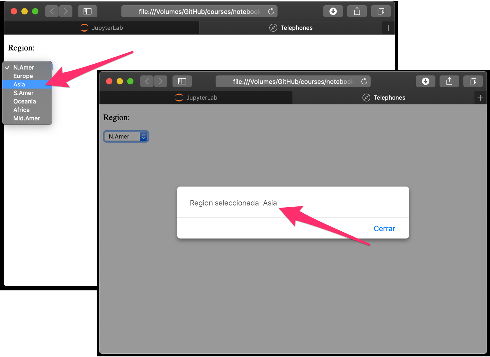
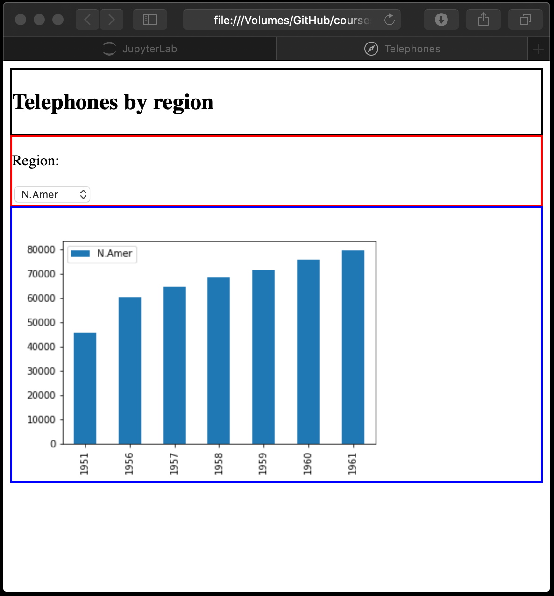
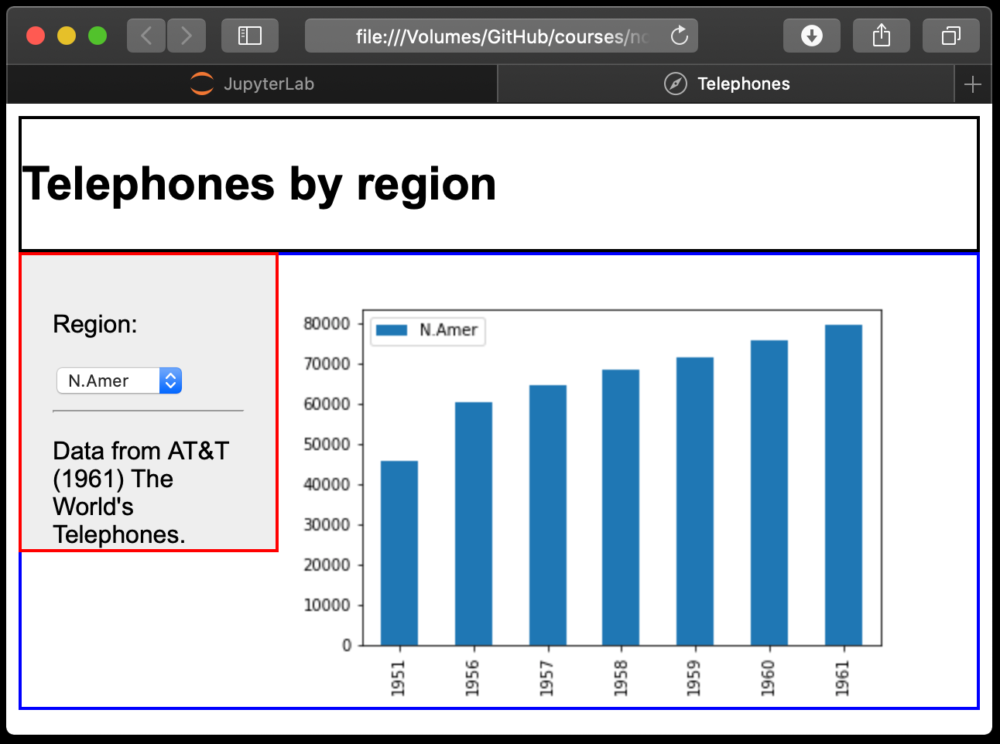
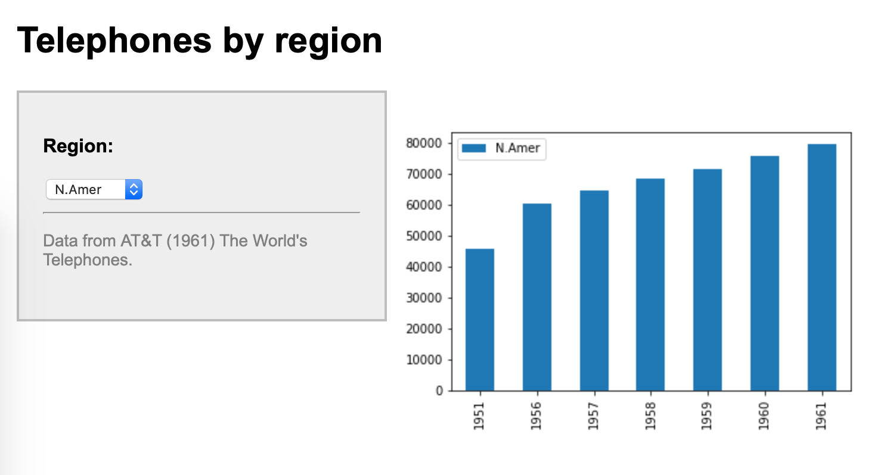

# Reporte básico en HTML

## Estructura de directorios

```
/
|___ data_lake/
|    |___ landing/ 
|    |___ raw/
|    |___ cleansed/
|    |___ business/
|         |___ dashboard/
|              |____ data.csv
|
|___ apps/
|    |___ dashboard/
|         |___ report.py
|
|___ web_servers/
     |___ dashboard/
          |___ index.html
          |___ figs/
               |___ N.Amer.png
               |___ Europe.png   
               |___ Asia.png
               |___ S.Amer.png
               |___ Oceania.png
               |___ Africa.png
               |___ Mid.Amer.png
```

## Construcción del reporte

Ejecute el comando: 

```bash
python3 apps/dashboard/report.py

```

Para generar los archivos de las figuras ubicadas en webserver/dashboard/figs.

## Visualización del reporte

Los archivos:

* index-1.html



* index-2.html


* index-3.html



* index-4.html



* index-5.html

